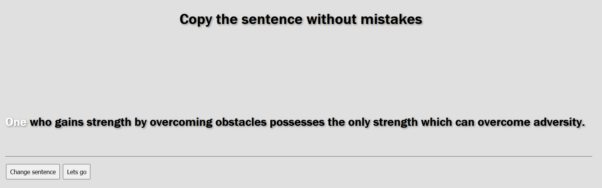

# FastTyper
FastTyper: learn how to type and improve your typing speed! Measure your typing speed! Gamified learning for typing.

# Features
- multiple color themes and dark mode
- supports many settings
- short word series, long word series
- sentences
- chose from 3 languages
  - English
  - Spanish
  - German
- Infinite mode
- Login with a nick-name. Nick-name is by default only stored in your local browser. It remains private inside your browser until you make it into the rankings. See rankings.
- Leader board, online rankings: If you make it into the top rankings then 2 pieces of information will be sent online: a) your nick-name and b) your words-per-minute score. If you are technically curious, the rankings are stored online in a Github Gist.
- Typing tips

# Try it now

To test your typing skills and take `FastTyper` for a spin, go to https://fasttyping.neocities.org

# Screenshots

# Enjoy

- If you like it, give it a :star: on :octocat:
- Fork it and sent PR. 
